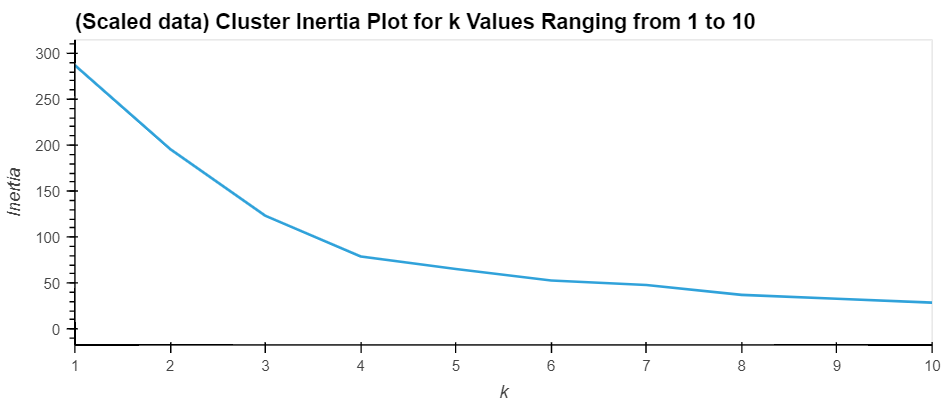

# Cluster Technique on Crypto Currency

In this program I have applied the clustering technique to segment data with price changes over different time windows. 

## Technologies
There are two critical python libraries in this program- `scikit-learn` & `hvplot`. Both are either already available in the dev environment or are automatically installed with `Anaconda`  

In order to verify their availabilty use the following codes

```python
conda list scikit-learn

conda list hvplot
```
---
## Installation Guide

In case above libraries are not available the following commands in the terminal will help install them.

```python
pip install -U scikit-learn

conda install -c pyviz hvplot
```

---

## Usage

The program uses price change data over various time periods (24 hr, 7 day, 14 day and so on upto 1 year). 

I used the elbow method (using the K-means inertia) to decide the number of cluster optimal for the given data and use that to create the clusters segments.

The analysis was done on two levels- in the first level, I used scaled price change data which converted all the features in the data using standard-normal-variate technique. For the second level, the scaled data was reduced based on principal components (the three principal components used in the analysis covered ~90% of variation of the original data).

In both levels of data, a total of 4 clusters was found to be optimal as seen in the elbow charts below




The following charts show the results of the cluster segments created using the scaled data and the principal components.


---

## Contributors


Kunal Srinivasan

---

## License

2022 edX Bootcamps 